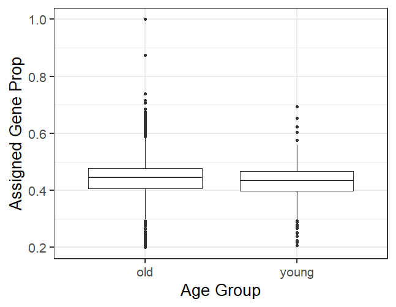
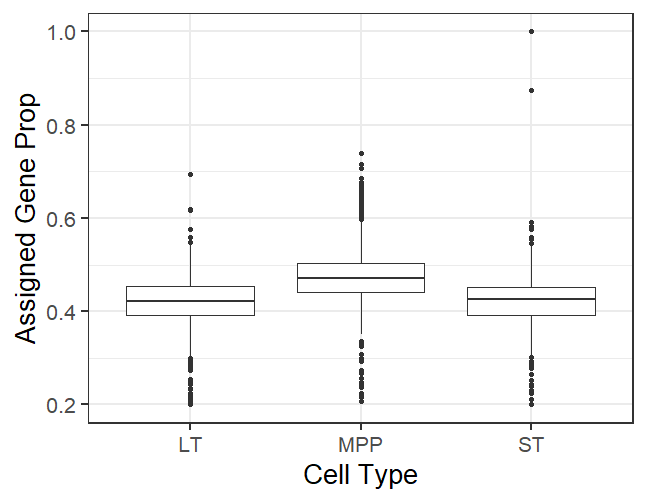
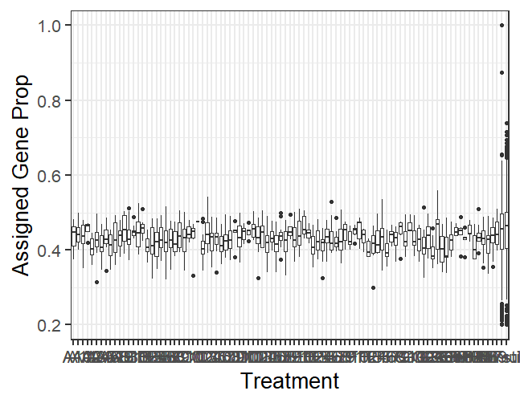
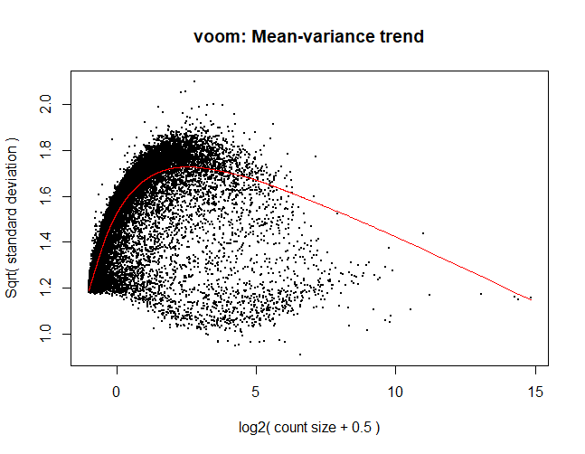
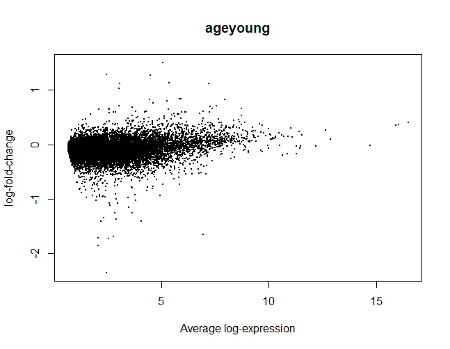
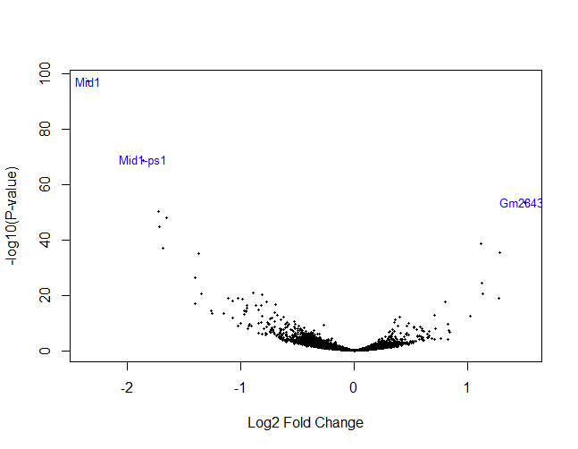

# Proyecto RNA-seq 2024
*Camila Villazón Soto Innes*

*12-febrero-2024*

## Sobre el proyecto
El proyecto tiene la finalida de evidenciar los conocimientos adquiridos durante el módulo de Análisis de datos de secuenciación masiva, impartido por el Dr. Leonardo Collado. 

## Estudio: *SRP110290*
Se emplearon los datos del estudio "*Heterogeneous Responses of Hematopoietic Stem Cells to Inflammatory Stimuli Are Altered with Age*", (M. Mann, 2018)([link](https://pubmed.ncbi.nlm.nih.gov/30540934/)).

Abstract:
> "Long-term hematopoietic stem cells (LT-HSCs) maintain hematopoietic output throughout an animal's lifespan. However, with age, the balance is disrupted, and LT-HSCs produce a myeloid-biased output, resulting in poor immune responses to infectious challenge and the development of myeloid leukemias. Here, we show that young and aged LT-HSCs respond differently to inflammatory stress, such that aged LT-HSCs produce a cell-intrinsic, myeloid-biased expression program. Using single-cell RNA sequencing (scRNA-seq), we identify a myeloid-biased subset within the LT-HSC population (mLT-HSCs) that is prevalent among aged LT-HSCs. We identify CD61 as a marker of mLT-HSCs and show that CD61-high LT-HSCs are uniquely primed to respond to acute inflammatory challenge. We predict that several transcription factors regulate the mLT-HSCs gene program and show that Klf5, Ikzf1, and Stat3 play an important role in age-related inflammatory myeloid bias. We have therefore identified and isolated an LT-HSC subset that regulates myeloid versus lymphoid balance under inflammatory challenge and with age."

## ¿Cómo correr?
En el directorio [code](https://github.com/CamilaVillazon/proyecto_rna-seq.github.io/tree/master/code/R) se encuentran 7 scripts que deben ser corridos secuencialmente.

### 1. [Paquetes y datos](https://github.com/CamilaVillazon/proyecto_rna-seq.github.io/blob/master/code/R/01_read_data_to_r.R): 
En este script se encuentran los paquetes a utilizar y la descarga con el paquete **recount3**.

### 2. [Formatear datos](https://github.com/CamilaVillazon/proyecto_rna-seq.github.io/blob/master/code/R/02_format_data.R): 
el script da un formato a los datos para que los posteriores análisis sean más sencillos.

### 3. [Filtrado de Datos](https://github.com/CamilaVillazon/proyecto_rna-seq.github.io/blob/master/code/R/03_filter_data.R): 
Con la finalidad de trabajar con datos estadísticamente relevantes, se descartan aquellos que no tengan una buena calidad o su nivel de expresión sea demasiado bajo.

### 4. [Normalización](https://github.com/CamilaVillazon/proyecto_rna-seq.github.io/blob/master/code/R/04_normalize_data.R): 
Normalizar datos con la paquetería de edgeR para que los datos tengan la misma escala. 

### 5. [Análisis de Exprsión Diferencial (DE)](https://github.com/CamilaVillazon/proyecto_rna-seq.github.io/blob/master/code/R/05_differential_expression.R): 
Se observa a través de boxplots la diferencia en la expresión de genes por diferentes variables: edad, tipo celular y tratamiento. 

Por grupo de edad no se observa una gran diferencia. 

### 6. [Modelo estadístico](https://github.com/CamilaVillazon/proyecto_rna-seq.github.io/blob/master/code/R/06_statistical_model.R):
El modelo estadístico se generó a partir de las tres variables antes mencionadas. 

Dicho modelo convierte las cuentas de las lecturas a log2 de las cuentas por millón para estimar la relación varianza-promedio.

ajustar datos a variable "age".

Con ayuda de un volcano plot se observa la más claramente la diferencia en los patrones de expresión y los genes más diferencialmente expresados:

Se observa cómo cambia la expresión de tres genes diferentes, en mayor medida de Mid1, un represor de respuesta inflamatoria, que se ve hipoexpresado en células jóvenes, que podría ser responsable de la diferente respuesta al estrés inflamatorio entre células viejas y jóvenes. 

### 7. [Visualización](https://github.com/CamilaVillazon/proyecto_rna-seq.github.io/blob/master/code/R/07_visualize_DE.R):
Por último, para tener na mejor idea de la expresión de los 50 genes con DE mayor. 

## Conclusiones
La implementación de herramientas como los paquetes de Bioconductor facilitan de gran manera los análisis de expresión diferencial. A lo largo del proyecto se ocuparon para manipular los datos para resultar en un análisis estadístico completo. 

Con las herramientas se logró comprender cómo es que el cambio en la expresión en diferentes grupos de edades de LT-HSC puede afectar su desempeño ante el estrés inflamatorio. 